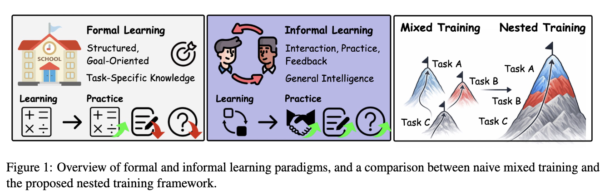
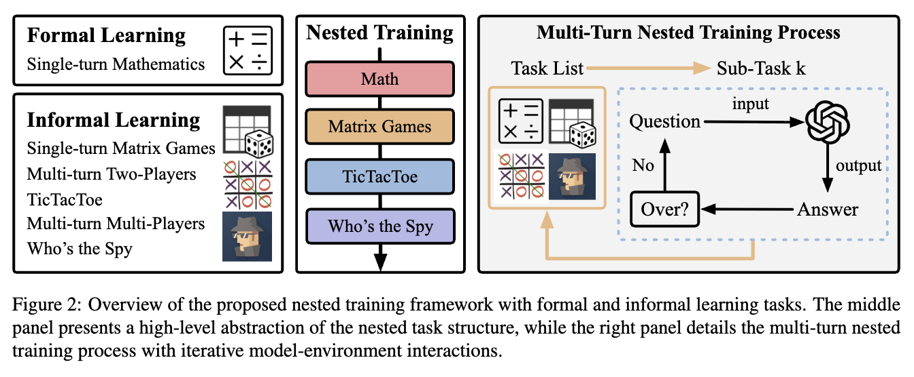

# GIFT: Games as Informal Training for Generalizable LLMs

This repository contains the official implementation of **GIFT**, a framework that leverages **game-based informal training** to improve the **generalization** of large language models.



**2026.1.15**: We release the official implementation of GIFT paper.
**2026.1.9**: The paper is released on ArXiv. https://arxiv.org/abs/2601.05633

---

## Table of Contents

- [Overview](#overview)
- [Method](#method)
- [Repository Structure](#repository-structure)
- [Installation](#installation)
- [Quickstart](#quickstart)
      - [Training](#training)
      - [Evaluation](#evaluation)
- [Adding New Games / Tasks](#adding-new-games--tasks)
- [Citation](#citation)
- [Acknowledgement](#acknowledgement)
- [License](#license)

---

## Overview

**GIFT** studies how *informal learning from interactive environments* (games) can complement formal learning and yield more **generalizable** LLM behaviors.

**Key ideas:**
- **Games as informal training**: interaction, practice, and feedback in multi-step environments.
- **Nested training**: a composite objective that encourages **joint success** across subtasks rather than single-task collapse.
- **Generalization focus**: evaluate on general abilities in addition to in-domain math and game success.

---

## Method

### Formal vs. Informal Learning
- **Formal learning**: structured, goal-oriented tasks (e.g., math).
- **Informal learning**: learning in rich environments via interaction, practice, and feedback (e.g., games).

### Nested Training

In **mixed training**, trajectories typically correspond to a single task; learning signals may become dominated by the easiest subtask and can harm joint generalization.

In **nested training**, each training episode/trajectory can include **multiple subtasks** with a **joint success** condition, encouraging balanced learning and improved stability.



---

## Repository Structure

```text
gift-llm/
├── images/                 # Figures used in README/docs
├── cases/                  # Figures for case study
├── config/                 # Hydra/YAML configs for training
├── external/               # Optional: WebShop Environments
├── ragen/                  # Main Training Codes
├── reason_test/            # Evaluation scripts
├── scripts/                # Entry-point scripts (train/convert/eval)
├── verl/                   # Base VeRL packages
├── requirements.txt
└── README.md
```

---
## Installation
Please refer to `setup_gift.md` to set up the gift environment.

---
## Quickstart
Scripts for training, convertion and evaluation are in `scripts` directory.

We use the `EnvPlayer` class in `ragen/env/base.py` to initialize and call opponents. Add `api-keys.json` to make api calls. The data structure in `api-keys` is as following:

```json
{
    "deepseek":["Your-API-Keys in official deepseek website"],
    "openrouter":["Your-API-Keys in openrouter website"],
    "dmx":["Your-API-Keys in dmxapi website"],
}
```

Environments for training each task are in `ragen/env/` directory, including:
- formal learning: math env `math_lv3to5`.
- informal learning: Matrix Games `nash_new`, TicTacToe `tictactoe`, and Who's the Spy `undercover`.
- nested training environment `compose_new`.

The mixed training can be constructed directly in yaml configs, such as `config/_14_FI1_mixed.yaml`.

### Training
Training scripts in `scripts` directory includes:
- single tasks: formal learning, math `math.sh`, informal learning, matrix games `nash.sh`, TicTacToe `tictactoe.sh`, and Who's the Spy `undercover.sh`.
- $\text{F+I}_1$ tasks: mixed training `FI1_mixed.sh` and nested training `FI1_nested.sh`.
- $\text{F+I}_2$ tasks: mixed training `FI2_mixed.sh` and nested training `FI2_nested.sh`.
- $\text{F+I}_3$ tasks: mixed training `FI3_mixed.sh` and nested training `FI3_nested.sh`.
- $\text{I}_2$ tasks in ablation study: mixed training `I2_mixed.sh` and nested training `I2_nested.sh`.

For example, run `./scripts/math.sh` in `GIFT-LLM` directory to train the model on the math task.

To convert the fsdp2 checkpoint models to huggingface format, please use the `merge.sh` script.

> We also provide the `monitor.sh` script to iteratively convert the old checkpoint files to huggingface models. Change the path in `monitor.sh` and `merge_dl.sh` to run this.

### Evaluation
Evaluate codes in `reason_test` directory includes:
- in-domain task MATH500 `lv3to5_dl.py`, Matrix Games `nash-new.py`, TicTacToe `tictactoe.py`, and Who's the Spy `undercover.py`
- MMLU `mmlu_dl.py`, and MMLU-Pro `mmlu_pro_dl.py`
- Creative writing CommonGen `common.py`.
- Social abilities SocialIQA `social.py`.

After running this scripts, the evaluation results will be added to `reason_test/` directory and some cases will be saved in `reason_test/results/` directory.

Please download huggingface datasets to evaluate.
- MATH500: https://huggingface.co/datasets/hkust-nlp/SimpleRL-Zoo-Data
- MMLU: https://huggingface.co/datasets/cais/mmlu
- MMLU-Pro: https://huggingface.co/datasets/TIGER-Lab/MMLU-Pro
- SocialIQA: https://huggingface.co/datasets/allenai/social_i_qa
- CommonGen: https://huggingface.co/datasets/allenai/commongen_lite_eval

---

## Adding New Games / Tasks
To add new games or tasks, please add this in `ragen/env/` directory, including `__init__.py`, `config.py`, and `env.py`. 
Then please log this new env in `ragen/env/__init__.py` and `config/envs.yaml`.

> Optional: Run `python -m ragen.env.[Your ENV Name].env` to test your env codes. 

### Adding New Nested Training Tasks
The nested training framework is in `compose_new` environments. Edit the `base_env_list` variables to change the nested sub-task. 

---

## Citation

If you find GIFT useful, we would appreciate it if you cite our work:

```bibtex
@misc{lyu2026giftgamesinformaltraining,
      title={GIFT: Games as Informal Training for Generalizable LLMs}, 
      author={Nuoyan Lyu and Bingbing Xu and Weihao Meng and Yige Yuan and Yang Zhang and Zhiyong Huang and Tat-Seng Chua and Huawei Shen},
      year={2026},
      eprint={2601.05633},
      archivePrefix={arXiv},
      primaryClass={cs.CL},
      url={https://arxiv.org/abs/2601.05633}, 
}
```

---
## Acknowledgement

This project is built on RAGEN framework(https://github.com/mll-lab-nu/RAGEN), based on VeRL framework(https://github.com/volcengine/verl). We change the core algorithms in RAGEN to support GIFT training.


---
## License

This project is released under the MIT License.

It includes code derived from the RAGEN framework, which is also licensed under the MIT License. 